# 设计文档：文章列表页（article-list-page）

## Overview

_概述_

在现有「文章内容集合 + 详情页」基础上，新增一个路由为 `/article` 的**文章列表页**：构建期从 `article` 内容集合读取全部非草稿文章，按发布时间倒序，以响应式卡片网格展示（标题 + 摘要 + 日期 + 标签），点击卡片跳转到既有详情页 `/article/<slug>`。同时在首页通过配置新增一个进入列表页的入口。

设计遵循站点两条既有原则：

1. **配置驱动、零硬编码文案**：列表页的标题/描述/大标题等可见文案由 `site.config.ts` 提供（新增可选的 `articleIndex` 配置块）；首页入口通过在 hero 区块新增一个 CTA 实现，均不改组件写死文案。
2. **静态优先 + 渐进增强**：列表在构建期渲染为静态 HTML，无 JS 也完整可见；卡片进入视口动画复用既有 `data-animate` 契约。

## Architecture

_架构_

```mermaid
graph TD
    subgraph Content["内容层"]
        MD[src/content/article/*.md]
        CC[content.config.ts<br/>article 集合 + zod schema]
    end

    subgraph Config["配置层"]
        SC[site.config.ts<br/>articleIndex 元信息 + hero CTA]
        SM[schema.ts<br/>校验 articleIndex]
    end

    subgraph Render["渲染层（构建期）"]
        LP[pages/article/index.astro<br/>列表页装配器]
        AC[ArticleCard.astro<br/>文章卡片组件]
        DP[pages/article/&#91;...slug&#93;.astro<br/>详情页（已存在）]
        L[Layout.astro<br/>全局骨架/SEO/令牌]
    end

    MD --> CC
    CC --> LP
    CC --> DP
    SC --> LP
    SM --> SC
    L --> LP
    LP --> AC
    AC -->|点击跳转| DP
```



**关键架构决策：**

1. **列表页为独立数据驱动页面**：与首页（`index.astro` 由 `site.config` 驱动）不同，列表页的数据源是**内容集合**，因此单独建 `src/pages/article/index.astro`，用 `getCollection('article')` 读取数据。这与已有的 `[...slug].astro` 详情页共用同一集合，数据一致。
2. **列表页可见文案仍走配置**：为不破坏“零硬编码文案”原则，页面标题/描述/大标题由新增的可选配置块 `articleIndex` 提供；缺省时回落到最小合理文案。
3. **卡片抽出为组件 `ArticleCard.astro`**：单一职责，便于复用与后续演进（如加封面图）；样式作用域化，复用全局设计令牌。
4. **首页入口用配置新增 CTA**：hero 区块的 `ctas` 增加一项 `{ label, href: '/article', variant: 'primary' }`，零组件改动。

## 路由与冲突分析

- 详情页 `src/pages/article/[...slug].astro` 的 `getStaticPaths` 生成的 `params.slug` 恒为非空（来自文章 id），因此 rest 路由**不会**匹配 `/article` 本身。
- 新增 `src/pages/article/index.astro` 精确匹配 `/article`（Astro 中静态/索引路由优先级高于 rest 动态路由）。
- 结论：`/article`（列表）与 `/article/<slug>`（详情）互不冲突。

## Components and Interfaces

_组件与接口_

### 组件 1：pages/article/index.astro（列表页装配器）

**职责**：读取集合、过滤草稿、排序，套用 `Layout.astro`，渲染卡片网格与空状态；初始化进入视口动画。

```typescript
// 伪代码
const cfg = validateConfig(rawConfig);
const meta = cfg.articleIndex ?? DEFAULT_ARTICLE_INDEX; // 缺省回落
const entries = (await getCollection('article', ({ data }) => !data.draft))
  .sort(byPubDateDescThenTitle);
// <Layout title={meta.title} description={meta.description} ...>
//   header(meta.heading, meta.intro)
//   entries.length ? grid(ArticleCard...) : emptyState
```

### 组件 2：ArticleCard.astro（文章卡片）

**职责**：把单个文章条目渲染成一张可点击卡片；仅负责“如何渲染”，不含数据获取。

```typescript
import type { CollectionEntry } from 'astro:content';

interface Props {
  entry: CollectionEntry<'article'>; // 单篇文章
  delay: number;                     // 动画延迟（毫秒），由列表页按序号计算
  lang: string;                      // 用于日期本地化格式
}
```

**渲染要点：**
- 整卡为 `<a href={/article/${entry.id}}>`，点击跳详情。
- 展示 `title`、`description`；`pubDate` 存在则展示本地化日期；`tags` 存在则展示标签。
- 加 `data-animate` 与 `--animate-delay`，复用全局动画契约。
- 悬停上浮 + 描边高亮，与 `ShowcaseSection` 卡片一致。

### 组件 3：Layout.astro（复用，无需改动）

列表页作为 `Layout` 的 slot 内容传入 `title`/`description`/`lang`/`theme` 等，复用其 head/SEO 与全局令牌。

### 数据模型扩展：SiteConfig.articleIndex（可选）

```typescript
interface SiteConfig {
  site: SiteMeta;
  theme: ThemeConfig;
  sections: Section[];
  articleIndex?: ArticleIndexMeta; // 新增：列表页可见文案
}

interface ArticleIndexMeta {
  title: string;        // 列表页 <title> / og:title
  description: string;  // 列表页 meta description
  heading: string;      // 页面大标题（H1）
  intro?: string;       // 副标题/引言（可选）
}
```

**缺省值（配置未提供 `articleIndex` 时回落）：**

```typescript
const DEFAULT_ARTICLE_INDEX = {
  title: '文章',
  description: '全部文章列表',
  heading: '文章',
};
```

## 算法伪代码（Algorithmic Pseudocode）

### 算法：文章排序 byPubDateDescThenTitle

```pascal
ALGORITHM compareEntries(a, b)
INPUT: a, b —— 两个文章条目
OUTPUT: 负/零/正，决定 a 相对 b 的顺序

BEGIN
  ta ← a.data.pubDate EXISTS ? a.data.pubDate.getTime() : -Infinity
  tb ← b.data.pubDate EXISTS ? b.data.pubDate.getTime() : -Infinity

  IF ta ≠ tb THEN
    RETURN tb - ta            // 日期降序：新在前；无日期(-∞)排最后
  ELSE
    RETURN compareString(a.data.title, b.data.title)  // 次级键：标题升序（稳定）
  END IF
END
```

**前置条件**：`a`、`b` 为已通过 zod schema 校验的集合条目。
**后置条件**：有日期者按时间降序在前；无日期者集中在末尾并按标题升序，排序稳定确定。

### 算法：articleIndex 校验（并入 validateConfig）

```pascal
ALGORITHM validateArticleIndex(cfg, errors)
BEGIN
  IF cfg.articleIndex EXISTS THEN
    ai ← cfg.articleIndex
    IF isEmpty(ai.title) THEN errors.add("articleIndex.title: 不能为空")
    IF isEmpty(ai.description) THEN errors.add("articleIndex.description: 不能为空")
    IF isEmpty(ai.heading) THEN errors.add("articleIndex.heading: 不能为空")
  END IF
  // 不存在则跳过（可选字段）
END
```

**前置条件**：`cfg` 为对象；在 `validateConfig` 主流程末尾调用。
**后置条件**：`articleIndex` 存在且任一必填字段为空时追加带路径的错误；不存在时无影响。

## Correctness Properties

_正确性属性_

- **P1 草稿不泄露**：对任意集合内容，列表页渲染的文章集合 = 集合中 `draft !== true` 的文章集合。
- **P2 排序正确**：渲染顺序满足 `compareEntries` 定义的全序——有日期者按 `pubDate` 降序，无日期者在后。
- **P3 一一对应链接**：每张卡片的 `href` 恒等于 `/article/${entry.id}`，与详情页路由一致（点击必达）。
- **P4 配置校验健全**：`articleIndex` 存在且必填字段为空 ⟺ `validateConfig` 抛 `ConfigError`。
- **P5 渐进增强**：禁用 JS 或 `prefers-reduced-motion` 时，全部卡片内容仍完整可见。

## Error Handling

_错误处理_

| 场景 | 条件 | 响应 |
| --- | --- | --- |
| 无已发布文章 | 过滤草稿后为空 | 渲染友好空状态，不报错 |
| `articleIndex` 字段非法 | 提供了但必填字段为空 | `validateConfig` 抛 `ConfigError`，中止构建，含字段路径 |
| 动画脚本异常/不支持 | `IntersectionObserver` 缺失或抛错 | 复用既有 `animate.ts` 兜底：直接给 `[data-animate]` 加 `.in-view` |

## Testing Strategy

_测试策略_

### 单元测试（Vitest，扩展 `schema.test.ts`）

- `articleIndex` 缺省（不提供）→ `validateConfig` 通过。
- `articleIndex` 提供但 `title`/`description`/`heading` 为空 → 抛 `ConfigError` 且信息含 `articleIndex.<field>` 路径。

### 构建验证

- `pnpm build` 通过，生成 `/article/index.html` 与各 `/article/<slug>/index.html`。
- 校验产物：列表页含每篇非草稿文章的标题与 description、卡片 `href` 指向对应详情页、首页含 `/article` 入口链接。

### 端到端（可选，沿用 Playwright）

- 访问 `/article` → 出现文章卡片 → 点击 → 跳转到对应详情页。
- 首页入口点击 → 到达 `/article`。

## 实施计划（Implementation Plan）

1. **扩展数据模型与校验**：`schema.ts` 增加 `ArticleIndexMeta` 与 `SiteConfig.articleIndex`，在 `validateConfig` 末尾校验；补充单元测试（先失败后通过）。
2. **配置内容**：`site.config.ts` 增加 `articleIndex` 块，并在 hero `ctas` 增加指向 `/article` 的入口。
3. **卡片组件**：新增 `src/components/ArticleCard.astro`。
4. **列表页**：新增 `src/pages/article/index.astro`（读取集合、排序、空状态、动画初始化）。
5. **验证**：`pnpm test`（校验逻辑）+ `pnpm build`（产物）+ 抽查产物 HTML。

## 依赖（Dependencies）

无新增依赖，全部基于既有 `astro`、`astro:content`、`vitest`、`fast-check`。
