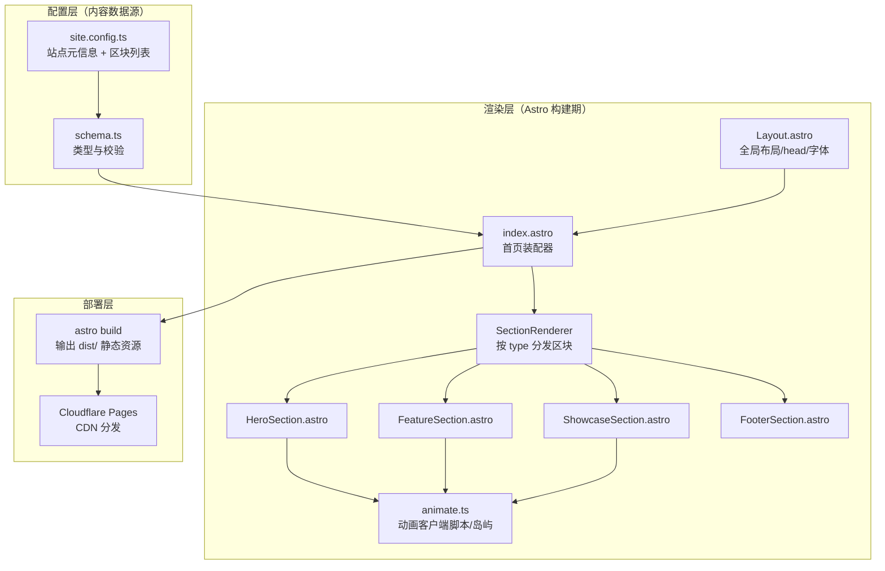
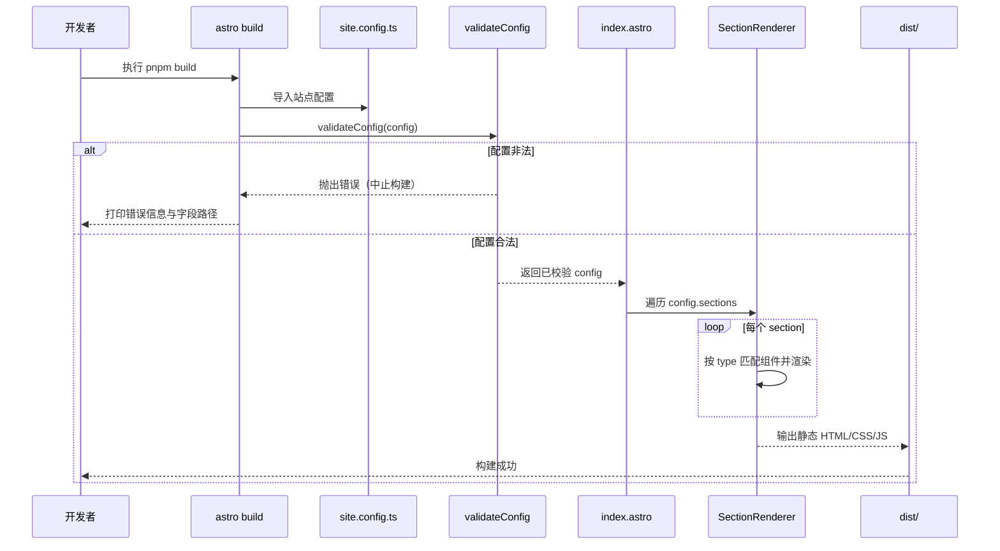
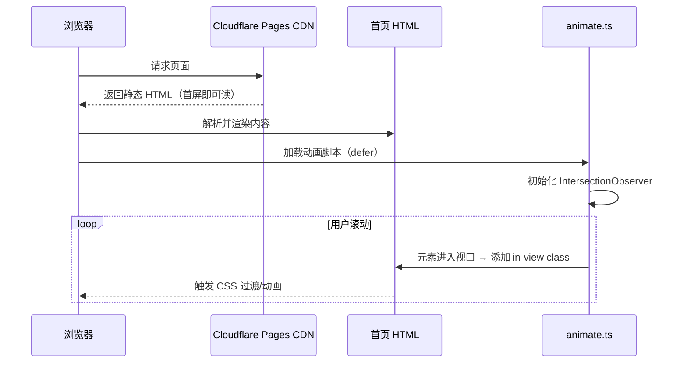

# 设计文档：Astro 首页宣发页（astro-landing-page）

## Overview

_概述_


本项目使用 [Astro](https://astro.build/) 框架构建一个静态优先（static-first）的个人宣发首页，首期内容为“Astro 技术介绍”，并配合酷炫的入场与滚动动画，呈现类似个人宣发页 / 项目介绍入口的视觉效果。最终产物为纯静态资源，部署至 **Cloudflare Pages** 并可被顺利访问。

设计的核心约束是**内容与展现分离**：页面所有可见文案、区块（section）顺序、动画参数、外链等，全部通过**配置文件**（`src/config/site.config.ts`）驱动，页面与组件只负责“如何渲染”，不硬编码任何业务文案。这样未来把首页扩展为“项目介绍入口”或“个人 Demo 入口”时，只需修改配置，无需改动组件代码。

技术选型上采用 Astro 的“零 JS 默认（zero-JS by default）+ 按需岛屿（Islands）”模型：静态内容在构建期渲染为 HTML，仅动画等交互部分作为轻量客户端脚本按需加载，从而在 Cloudflare Pages 上获得极快的首屏加载与优秀的 Lighthouse 分数。

## Architecture

_架构_


整体分为三层：**配置层（数据源）→ 渲染层（Astro 组件）→ 部署层（Cloudflare Pages）**。



**关键架构决策与理由：**

1. **静态构建 + 无服务端**：首页无动态数据需求，使用 Astro 默认的静态输出（`output: 'static'`），产物为纯 HTML/CSS/JS，天然契合 Cloudflare Pages 的静态托管模型，无需 SSR 适配器，部署最简单、成本最低。
2. **配置驱动的区块装配**：`index.astro` 不写死任何区块，而是读取配置中的 `sections` 数组，交给 `SectionRenderer` 按 `type` 字段分发到对应组件。新增/调整/排序区块只改配置。
3. **动画作为渐进增强**：动画通过一个轻量客户端脚本（基于 `IntersectionObserver` + CSS 变量/`@keyframes`）实现；即使 JS 未加载，内容依然完整可读（无障碍与 SEO 友好）。
4. **类型安全的配置**：配置文件用 TypeScript 类型约束，并在构建期做一次运行时校验（`validateConfig`），配置写错能在 `astro build` 阶段暴露，而非上线后才发现。

## 时序图（Sequence Diagrams）

### 构建期：配置到静态 HTML



### 运行期：浏览器加载与动画触发



## Components and Interfaces

_组件与接口_


### 组件 1：Layout.astro（全局布局）

**职责**：提供 `<html>`/`<head>`/`<body>` 骨架，注入站点元信息（title、description、favicon、字体、全局样式、动画基础样式）。

```typescript
// Layout.astro 的 Props 接口
interface LayoutProps {
  title: string;        // 页面标题，来自 config.site.title
  description: string;  // SEO 描述，来自 config.site.description
  lang?: string;        // 语言，默认 'zh-CN'
}
```

**职责清单**：
- 渲染 `<head>` 中的 SEO / OpenGraph 元标签
- 引入全局 CSS 与动画基础样式
- 通过 `<slot />` 承载页面主体

### 组件 2：index.astro（首页装配器）

**职责**：读取并校验配置，遍历 `sections`，委托 `SectionRenderer` 渲染。不包含任何写死的业务文案。

```typescript
// 装配逻辑（伪代码形式，见“算法伪代码”一节）
const config = validateConfig(rawConfig);
// 渲染：<Layout {...config.site}> {config.sections.map(renderSection)} </Layout>
```

### 组件 3：SectionRenderer（区块分发器）

**职责**：接收单个 `Section` 数据，根据 `section.type` 分发到具体区块组件；遇到未知类型时安全跳过并告警。

```typescript
interface SectionRendererProps {
  section: Section;   // 见“数据模型”
  index: number;      // 区块序号，用于动画延迟与锚点 id
}
```

### 组件 4：区块组件族（HeroSection / FeatureSection / ShowcaseSection / FooterSection）

**职责**：每种区块组件只关心“如何把该类型的数据渲染成 HTML + 动画标记”。

```typescript
// 所有区块组件共享的约定：Props 即该类型的数据对象
interface HeroSectionProps { data: HeroSection }
interface FeatureSectionProps { data: FeatureSection }
interface ShowcaseSectionProps { data: ShowcaseSection }
interface FooterSectionProps { data: FooterSection }
```

**动画约定**：区块内需要动画的元素统一加上 `data-animate` 属性与可选的 `data-animate-delay`，由 `animate.ts` 统一驱动，组件本身不写动画逻辑。

### 组件 5：animate.ts（动画客户端脚本）

**职责**：页面加载后初始化 `IntersectionObserver`，监听带 `data-animate` 的元素，进入视口时添加 `.in-view` 类以触发 CSS 动画；尊重用户的 `prefers-reduced-motion` 设置。

```typescript
interface AnimateOptions {
  threshold?: number;      // 触发阈值，默认 0.15
  rootMargin?: string;     // 预触发边距，默认 '0px 0px -10% 0px'
  once?: boolean;          // 是否只触发一次，默认 true
}

function initAnimations(options?: AnimateOptions): void;
```

## Data Models

_数据模型_


这是本设计的核心：**所有页面内容都由配置对象描述**。配置文件位于 `src/config/site.config.ts`，类型定义位于 `src/config/schema.ts`。

### 顶层配置：SiteConfig

```typescript
// 站点级元信息 + 区块有序列表
interface SiteConfig {
  site: SiteMeta;         // 站点元信息（标题、描述、语言、主题等）
  theme: ThemeConfig;     // 主题与动画全局参数
  sections: Section[];    // 有序区块列表，决定页面从上到下的内容
}

interface SiteMeta {
  title: string;          // 站点/页面标题
  description: string;    // SEO 描述
  lang: string;           // 语言，如 'zh-CN'
  author?: string;        // 作者名（可选）
  favicon?: string;       // favicon 路径（可选）
  ogImage?: string;       // 社交分享图（可选）
}

interface ThemeConfig {
  primaryColor: string;       // 主色调，注入为 CSS 变量 --color-primary
  accentColor: string;        // 强调色，注入为 CSS 变量 --color-accent
  animationEnabled: boolean;  // 全局动画开关
  animationBaseDelay: number; // 区块动画基础延迟（毫秒）
}
```

**校验规则（SiteConfig）**：
- `site.title`、`site.description` 非空
- `site.lang` 符合 BCP-47 基本格式（如 `zh-CN`、`en`）
- `theme.primaryColor` / `accentColor` 为合法 CSS 颜色字符串（`#` 开头或 CSS 颜色关键字）
- `sections` 至少包含 1 个元素

### 区块联合类型：Section

采用**可辨识联合（discriminated union）**，以 `type` 字段区分区块种类，保证类型安全的分发。

```typescript
// 所有区块共有的基础字段
interface SectionBase {
  id: string;             // 唯一标识，用作 DOM 锚点 id
  type: SectionType;      // 区块类型（辨识字段）
  animate?: boolean;      // 该区块是否启用动画，默认继承全局
}

type SectionType = 'hero' | 'feature' | 'showcase' | 'footer';

// Hero 首屏区块：大标题 + 副标题 + CTA 按钮 + 背景动画
interface HeroSection extends SectionBase {
  type: 'hero';
  headline: string;               // 主标题
  subheadline: string;            // 副标题
  ctas: CallToAction[];           // 行动按钮列表
  backgroundEffect?: BgEffect;    // 背景动画效果类型
}

// Feature 特性区块：一组特性卡片（如介绍 Astro 的核心优势）
interface FeatureSection extends SectionBase {
  type: 'feature';
  heading: string;                // 区块标题
  intro?: string;                 // 区块引言（可选）
  features: FeatureItem[];        // 特性卡片列表
}

// Showcase 展示区块：面向未来“项目/Demo 入口”，一组可点击卡片
interface ShowcaseSection extends SectionBase {
  type: 'showcase';
  heading: string;
  items: ShowcaseItem[];          // 展示项（项目/Demo）
}

// Footer 页脚区块：版权 + 社交链接
interface FooterSection extends SectionBase {
  type: 'footer';
  copyright: string;
  links: LinkItem[];
}

// —— 复用子类型 ——
interface CallToAction {
  label: string;                  // 按钮文案
  href: string;                   // 跳转链接
  variant: 'primary' | 'ghost';   // 样式变体
  external?: boolean;             // 是否外链（新窗口打开）
}

interface FeatureItem {
  icon?: string;                  // 图标名或 emoji
  title: string;
  description: string;
}

interface ShowcaseItem {
  title: string;
  description: string;
  href: string;
  thumbnail?: string;             // 缩略图路径（可选）
  tags?: string[];                // 标签（可选）
}

interface LinkItem {
  label: string;
  href: string;
  external?: boolean;
}

type BgEffect = 'gradient-flow' | 'particles' | 'aurora' | 'none';
```

**校验规则（Section）**：
- `id` 在同一份配置内唯一
- `type` 必须为已知 `SectionType`
- `hero.ctas`、`feature.features`、`showcase.items` 中每一项的 `label`/`title` 非空
- 所有 `href` 为非空字符串；`external: true` 时渲染 `target="_blank" rel="noopener noreferrer"`

## 算法伪代码（Algorithmic Pseudocode）

### 算法 1：配置校验 validateConfig

```pascal
ALGORITHM validateConfig(raw)
INPUT: raw —— 从 site.config.ts 导入的原始配置对象
OUTPUT: config —— 已校验的 SiteConfig（否则中止构建并报错）

BEGIN
  ASSERT raw ≠ null
  errors ← empty list

  // 1. 校验站点元信息
  IF isEmpty(raw.site.title) THEN errors.add("site.title 不能为空")
  IF isEmpty(raw.site.description) THEN errors.add("site.description 不能为空")
  IF NOT matchesBcp47(raw.site.lang) THEN errors.add("site.lang 格式非法")

  // 2. 校验主题
  IF NOT isCssColor(raw.theme.primaryColor) THEN errors.add("theme.primaryColor 非法颜色")
  IF NOT isCssColor(raw.theme.accentColor) THEN errors.add("theme.accentColor 非法颜色")

  // 3. 校验区块列表
  IF length(raw.sections) < 1 THEN errors.add("sections 至少需要一个区块")

  seenIds ← empty set
  FOR each section IN raw.sections DO
    IF section.id IN seenIds THEN
      errors.add("重复的 section id: " + section.id)
    END IF
    seenIds.add(section.id)

    IF section.type NOT IN {hero, feature, showcase, footer} THEN
      errors.add("未知的 section.type: " + section.type)
    ELSE
      errors.addAll(validateSectionByType(section))   // 分类型细校验
    END IF
  END FOR

  // 4. 汇总
  IF length(errors) > 0 THEN
    THROW ConfigError(join(errors, "\n"))   // 中止构建，打印全部错误
  END IF

  RETURN raw AS SiteConfig
END
```

**前置条件（Preconditions）**：
- `raw` 由 `site.config.ts` 静态导入，构建期一定存在

**后置条件（Postconditions）**：
- 返回值必然是结构合法的 `SiteConfig`
- 任一校验失败时抛出 `ConfigError` 并中止 `astro build`，错误信息含具体字段路径
- 不修改输入对象（无副作用）

**循环不变式（Loop Invariants）**：
- 遍历 `sections` 时，`seenIds` 恒等于“已遍历区块的 id 集合”
- `errors` 单调增长，仅追加不删除

### 算法 2：区块分发渲染 renderSection

```pascal
ALGORITHM renderSection(section, index, theme)
INPUT: section —— 单个已校验区块; index —— 序号; theme —— 主题配置
OUTPUT: 该区块对应的 HTML 片段

BEGIN
  ASSERT section.type IN {hero, feature, showcase, footer}

  // 计算动画延迟：全局开关 AND 区块开关 均为真才启用
  animateOn ← theme.animationEnabled AND (section.animate ≠ false)
  delay ← IF animateOn THEN index × theme.animationBaseDelay ELSE 0

  // 按 type 分发到对应组件（可辨识联合，编译期穷尽检查）
  MATCH section.type WITH
    | 'hero'     → RETURN <HeroSection data={section} delay={delay} />
    | 'feature'  → RETURN <FeatureSection data={section} delay={delay} />
    | 'showcase' → RETURN <ShowcaseSection data={section} delay={delay} />
    | 'footer'   → RETURN <FooterSection data={section} delay={delay} />
  END MATCH
END
```

**前置条件**：`section` 已通过 `validateConfig`，`section.type` 合法。
**后置条件**：返回与 `section.type` 一致的组件；`animateOn` 为假时不产生任何动画标记。
**循环不变式**：N/A（无循环，纯分发）。

### 算法 3：动画初始化 initAnimations（客户端）

```pascal
ALGORITHM initAnimations(options)
INPUT: options —— 阈值/边距/是否只触发一次
OUTPUT: 无（副作用：为进入视口的元素添加 .in-view 类）

BEGIN
  // 尊重无障碍偏好：用户要求减少动态则直接全部显示
  IF prefersReducedMotion() THEN
    FOR each el IN queryAll("[data-animate]") DO
      el.addClass("in-view")     // 直接展示终态，不做过渡
    END FOR
    RETURN
  END IF

  observer ← new IntersectionObserver(callback, options)
  FOR each el IN queryAll("[data-animate]") DO
    observer.observe(el)
  END FOR

  PROCEDURE callback(entries)
    FOR each entry IN entries DO
      IF entry.isIntersecting THEN
        entry.target.addClass("in-view")
        IF options.once THEN observer.unobserve(entry.target)
      END IF
    END FOR
  END PROCEDURE
END
```

**前置条件**：DOM 已就绪（脚本 `defer` 或监听 `DOMContentLoaded`）。
**后置条件**：所有 `[data-animate]` 元素最终都会获得 `.in-view`（滚动到位或减少动态时立即获得）。
**循环不变式**：已 `observe` 的元素集合恒为已遍历的 `[data-animate]` 元素集合。

## 关键函数签名与形式化规格（Key Functions with Formal Specifications）

```typescript
// src/config/schema.ts
function validateConfig(raw: unknown): SiteConfig;
// 前置：raw 为任意导入值
// 后置：返回合法 SiteConfig，否则抛 ConfigError（构建中止）

function isCssColor(value: string): boolean;
// 后置：value 为 '#RGB'/'#RRGGBB' 或 CSS 颜色关键字时返回 true

// src/scripts/animate.ts
function initAnimations(options?: AnimateOptions): void;
// 前置：运行于浏览器且 DOM 就绪
// 后置：为 [data-animate] 元素绑定进入视口触发；prefers-reduced-motion 时立即展示

function prefersReducedMotion(): boolean;
// 后置：读取 matchMedia('(prefers-reduced-motion: reduce)').matches
```

## 示例用法（Example Usage）

### 配置文件示例（内容全部在此，页面零硬编码）

```typescript
// src/config/site.config.ts
import type { SiteConfig } from './schema';

const config: SiteConfig = {
  site: {
    title: 'Astro 宣发首页',
    description: '基于 Astro 构建的极速静态站点，作为项目与 Demo 的入口。',
    lang: 'zh-CN',
    author: 'yukun',
  },
  theme: {
    primaryColor: '#7c3aed',
    accentColor: '#22d3ee',
    animationEnabled: true,
    animationBaseDelay: 120,
  },
  sections: [
    {
      id: 'hero',
      type: 'hero',
      headline: '用 Astro 构建极速站点',
      subheadline: '内容驱动、零冗余 JS、部署即上线。',
      backgroundEffect: 'aurora',
      ctas: [
        { label: '了解更多', href: '#features', variant: 'primary' },
        { label: 'Astro 官网', href: 'https://astro.build', variant: 'ghost', external: true },
      ],
    },
    {
      id: 'features',
      type: 'feature',
      heading: '为什么选择 Astro',
      intro: '面向内容站点的现代框架。',
      features: [
        { icon: '⚡', title: '极速', description: '默认零 JS，首屏飞快。' },
        { icon: '🧩', title: '岛屿架构', description: '按需加载交互组件。' },
        { icon: '🚀', title: '易部署', description: '静态产物一键上 Cloudflare Pages。' },
      ],
    },
    {
      id: 'footer',
      type: 'footer',
      copyright: '© 2025 yukun',
      links: [{ label: 'GitHub', href: 'https://github.com', external: true }],
    },
  ],
};

export default config;
```

### 首页装配示例

```astro
---
// src/pages/index.astro
import Layout from '../layouts/Layout.astro';
import SectionRenderer from '../components/SectionRenderer.astro';
import rawConfig from '../config/site.config';
import { validateConfig } from '../config/schema';

const config = validateConfig(rawConfig); // 构建期校验，失败即中止
---
<Layout title={config.site.title} description={config.site.description} lang={config.site.lang}>
  {config.sections.map((section, i) => (
    <SectionRenderer section={section} index={i} theme={config.theme} />
  ))}
</Layout>
```

## Correctness Properties

_正确性属性_


以下属性对所有合法/非法输入均应成立，可作为属性测试（property-based testing）的基础：

### Property 1: 配置驱动完整性

对任意合法 `SiteConfig`，渲染出的页面区块数量与顺序，恒等于 `config.sections` 的长度与顺序。
`∀ config. renderedSections(page(config)) ≡ config.sections`（按序一一对应）

### Property 2: 零硬编码

对任意两个仅内容不同的合法配置 `c1`、`c2`，渲染差异仅来源于配置差异——组件代码不引入任何固定业务文案。

### Property 3: 校验健全性

对任意非法配置，`validateConfig` 必抛 `ConfigError` 且不产出页面；对任意合法配置，必返回等价的 `SiteConfig`。
`∀ raw. isValid(raw) ⟺ validateConfig(raw) 成功返回`

### Property 4: 动画渐进增强

对任意配置，禁用 JS 或 `prefers-reduced-motion` 时，所有区块内容仍完整可见（终态可读）。

### Property 5: 未知区块安全性

若出现未知 `type`（理论上被校验拦截），渲染层不崩溃且不产生错误 DOM。

### Property 6: 外链安全

`external: true` 的链接渲染结果恒包含 `rel="noopener noreferrer"`。

## Error Handling

_错误处理_


### 场景 1：配置字段缺失或非法

**条件**：`site.config.ts` 中必填字段为空、颜色非法、`sections` 为空、`id` 重复。
**响应**：`validateConfig` 汇总所有错误并抛 `ConfigError`，`astro build` 中止并在终端打印每条错误及字段路径。
**恢复**：开发者按提示修正配置后重新构建。

### 场景 2：未知区块类型

**条件**：`section.type` 不在已知集合内。
**响应**：`validateConfig` 阶段即报错拦截；即便绕过，`SectionRenderer` 的 `match` 默认分支跳过该区块并 `console.warn`。
**恢复**：修正为合法类型。

### 场景 3：客户端动画脚本异常

**条件**：`IntersectionObserver` 不可用（极旧浏览器）或脚本抛错。
**响应**：`try/catch` 兜底，直接给所有 `[data-animate]` 元素加 `.in-view`（展示终态）。
**恢复**：内容不受影响，仅失去动效。

### 场景 4：Cloudflare Pages 构建失败

**条件**：构建命令/输出目录/Node 版本配置不当。
**响应**：Pages 控制台显示构建日志与失败原因。
**恢复**：核对构建命令 `pnpm build`、输出目录 `dist`、Node 版本（`.nvmrc` 或环境变量 `NODE_VERSION`）。

## Testing Strategy

_测试策略_


### 单元测试（Unit Testing）

- **`validateConfig`**：覆盖合法配置通过、各类非法配置（空标题、非法颜色、空 sections、重复 id、未知 type）均抛错且错误信息含字段路径。
- **`isCssColor` / `prefersReducedMotion`**：边界输入。
- 工具/框架：**Vitest**。

### 属性测试（Property-Based Testing）

- **属性库**：**fast-check**（与 Vitest 集成）。
- 关键属性：
  - 生成任意合法 `SiteConfig`，断言渲染区块数与顺序等于 `config.sections`（对应正确性属性 1）。
  - 生成随机破坏字段的配置，断言 `validateConfig` 必抛错（对应正确性属性 3）。

### 集成 / 端到端测试（Integration / E2E）

- 使用 **Playwright** 对构建产物做冒烟测试：页面正常加载、各区块存在、外链带 `rel="noopener noreferrer"`、禁用 JS 时内容仍可见。
- 构建校验：CI 中运行 `astro build` 确保配置合法且产物生成。

## 性能考量（Performance Considerations）

- **默认零 JS**：仅动画脚本作为极小客户端 JS，`defer` 加载，不阻塞首屏。
- **静态产物 + CDN**：Cloudflare Pages 全球 CDN 分发，TTFB 极低。
- **动画用 CSS 优先**：动画通过 CSS `transform`/`opacity` 实现（GPU 合成），避免触发布局回流；`IntersectionObserver` 仅切换 class。
- **资源优化**：图片建议用 Astro 的 `<Image />`（`astro:assets`）做尺寸与格式优化；字体子集化并 `preload`。
- **目标**：Lighthouse 移动端性能 ≥ 95。

## 安全考量（Security Considerations）

- **纯静态站点**：无服务端、无数据库、无用户输入，攻击面极小。
- **外链防护**：所有 `external` 链接统一 `target="_blank" rel="noopener noreferrer"`，防止 `window.opener` 劫持。
- **无密钥**：配置文件仅含公开展示内容，不存放任何密钥或敏感信息。
- **CSP（可选增强）**：可在 Cloudflare Pages 通过 `_headers` 文件配置内容安全策略，进一步限制脚本来源。

## 依赖（Dependencies）

**运行时 / 构建**：
- `astro`（核心框架，静态输出）
- Node.js（构建环境，建议 LTS，如 20.x）
- 包管理器：`pnpm`（亦可 npm/yarn）

**开发 / 测试**：
- `vitest`（单元测试）
- `fast-check`（属性测试）
- `@playwright/test`（端到端冒烟测试，可选）
- `typescript`（类型检查，Astro 内置支持）

**部署**：
- Cloudflare Pages
  - 构建命令：`pnpm build`
  - 输出目录：`dist`
  - 无需 SSR 适配器（`output: 'static'`）

**可选**：
- `@astrojs/sitemap`（生成站点地图，利于 SEO）
- `astro:assets`（图片优化，Astro 内置）
