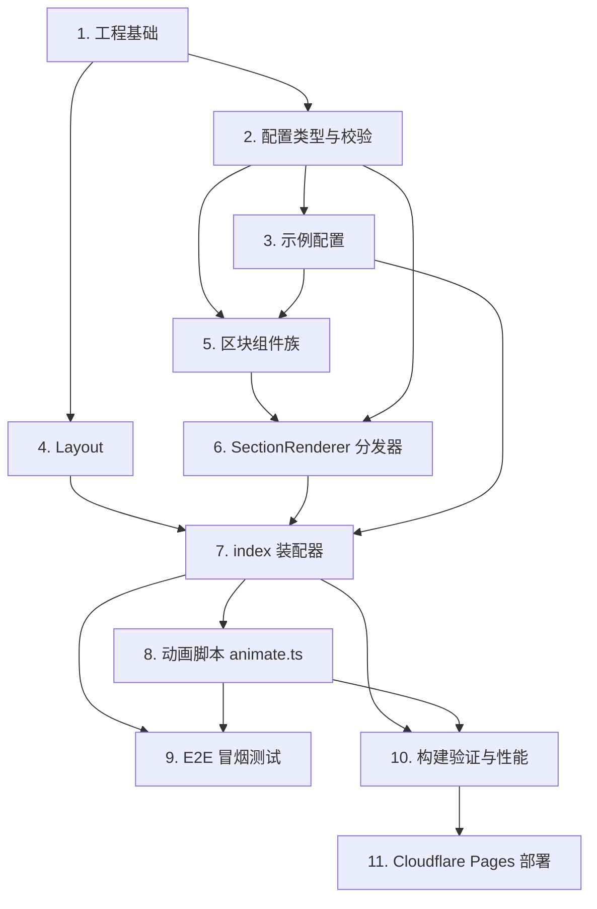

# Implementation Plan

_实现计划：Astro 首页宣发页（astro-landing-page）_

## Overview

_概述_

按「工程基础 → 配置类型与校验（TDD）→ 示例配置 → 布局与区块组件 → 分发与装配 → 动画 → 测试与构建 → 部署」的顺序推进。核心原则是内容配置化、组件零硬编码，动画作为渐进增强。校验逻辑采用测试先行（先写失败测试再实现）。

## Tasks

_任务_

- [x] 1. 初始化 Astro 项目与工程基础
  - 使用 Astro 创建静态项目骨架，确认 `astro.config.mjs` 为 `output: 'static'`
  - 配置包管理器为 `pnpm`，添加 `.nvmrc`（Node LTS，如 20.x）
  - 建立目录结构：`src/config/`、`src/layouts/`、`src/components/`、`src/scripts/`、`src/pages/`
  - _Requirements: 1.1, 2.3_

- [x] 2. 定义配置类型与校验（schema）
- [x] 2.1 编写 `src/config/schema.ts` 类型定义
  - 定义 `SiteConfig`、`SiteMeta`、`ThemeConfig`
  - 定义可辨识联合 `Section`（`hero`/`feature`/`showcase`/`footer`）及复用子类型（`CallToAction`/`FeatureItem`/`ShowcaseItem`/`LinkItem`/`BgEffect`）
  - _Requirements: 3.1, 4.1, 6.1, 6.2_
- [x] 2.2 实现 `validateConfig` 与 `isCssColor`（先写失败测试）
  - 用 Vitest 编写覆盖：合法配置通过；空标题、非法颜色、空 `sections`、重复 `id`、未知 `type` 均抛 `ConfigError` 且信息含字段路径；`validateConfig` 无副作用
  - 实现 `validateConfig`/`isCssColor` 使测试通过
  - _Requirements: 7.1, 7.2, 7.3_
- [x] 2.3 属性测试：配置校验健全性
  - 用 fast-check 生成随机破坏字段的配置，断言 `validateConfig` 必抛错（对应正确性属性 3）
  - _Requirements: 7.2_

- [ ] 3. 编写示例配置文件
  - 创建 `src/config/site.config.ts`，填入 Astro 介绍内容（hero + feature + footer，含外链示例）
  - 内容全部置于配置中，作为「零硬编码」的数据源
  - _Requirements: 3.1, 3.3, 4.2, 4.3, 4.4_

- [x] 4. 实现全局布局 Layout.astro
  - 渲染 `<html lang>`/`<head>`/`<body>` 骨架
  - 根据配置输出 `<title>`、`<meta name="description">`、`lang`、可选 `favicon`/`ogImage`
  - 注入主题 CSS 变量（`--color-primary`/`--color-accent`）与全局/动画基础样式，`<slot />` 承载主体
  - _Requirements: 8.1, 8.2, 1.3_

- [x] 5. 实现区块组件族
- [x] 5.1 HeroSection.astro
  - 渲染主标题、副标题、CTA 按钮；为动画元素加 `data-animate`（不写动画逻辑）
  - _Requirements: 4.2_
- [x] 5.2 FeatureSection.astro
  - 渲染区块标题、引言与特性卡片（图标/标题/描述），元素加 `data-animate`
  - _Requirements: 4.3_
- [x] 5.3 ShowcaseSection.astro
  - 渲染可点击的项目/Demo 入口卡片（标题/描述/链接/可选缩略图/标签）
  - _Requirements: 6.1_
- [x] 5.4 FooterSection.astro
  - 渲染版权与链接列表
  - _Requirements: 4.4_
- [x] 5.5 外链安全处理（统一约定）
  - 对 `external: true` 的链接统一渲染 `target="_blank"` 与 `rel="noopener noreferrer"`
  - _Requirements: 9.1_

- [x] 6. 实现区块分发器 SectionRenderer.astro
  - 按 `section.type` 分发到对应区块组件，计算动画延迟（全局开关 AND 区块开关）
  - 未知类型时跳过并 `console.warn`，不产生错误 DOM
  - _Requirements: 3.2, 6.2, 7.4, 5.4_

- [x] 7. 实现首页装配器 index.astro
  - 导入配置并调用 `validateConfig`（构建期校验，失败即中止）
  - 遍历 `config.sections`，按序委托 `SectionRenderer` 渲染，页面零硬编码文案
  - _Requirements: 3.2, 3.3, 3.4, 7.1_

- [x] 8. 实现动画脚本 animate.ts
  - 实现 `initAnimations`：基于 `IntersectionObserver` 为进入视口元素加 `.in-view`，触发 CSS `transform`/`opacity` 动画
  - 实现 `prefersReducedMotion`：命中时直接展示终态
  - `try/catch` 兜底：`IntersectionObserver` 不可用或异常时，为所有 `[data-animate]` 直接加 `.in-view`
  - 脚本以 `defer` 加载，不阻塞首屏
  - _Requirements: 5.1, 5.2, 5.3, 1.3_

- [x] 9. 编写端到端冒烟测试（Playwright）
  - 页面正常加载且各区块存在
  - 外链带 `rel="noopener noreferrer"`
  - 禁用 JS 时区块内容仍完整可见（渐进增强）
  - _Requirements: 1.2, 4.1, 5.3, 9.1_

- [x] 10. 构建验证与性能优化
  - 运行 `pnpm build` 确认配置合法且产物生成到 `dist/`
  - 图片改用 `astro:assets` 的 `<Image />`；核对 CSS 动画走 GPU 合成、脚本 `defer`
  - 本地对产物做一次 Lighthouse 移动端评估，以性能 ≥ 95 为目标
  - _Requirements: 1.1, 2.1, 10.1, 10.2_

- [ ] 11. Cloudflare Pages 部署配置与验证
  - 在 Cloudflare Pages 设置构建命令 `pnpm build`、输出目录 `dist`、`NODE_VERSION` 环境变量
  - （可选）添加 `_headers` 配置基础 CSP
  - 部署后在浏览器访问，确认首页与各区块正常展示
  - _Requirements: 2.1, 2.2, 2.3_

## Task Dependency Graph

_任务依赖图_



```json
{
  "waves": [
    { "wave": 1, "tasks": ["1"] },
    { "wave": 2, "tasks": ["2", "4"] },
    { "wave": 3, "tasks": ["3"] },
    { "wave": 4, "tasks": ["5"] },
    { "wave": 5, "tasks": ["6"] },
    { "wave": 6, "tasks": ["7"] },
    { "wave": 7, "tasks": ["8"] },
    { "wave": 8, "tasks": ["9", "10"] },
    { "wave": 9, "tasks": ["11"] }
  ]
}
```

## Notes

_备注_

- 任务 2.2 采用测试先行（TDD）：先写失败测试，确认失败原因正确后再实现。
- 组件层不得写死业务文案，所有内容来自 `src/config/site.config.ts`（对应需求 3）。
- E2E 与 Lighthouse 属可选增强，若环境受限可在部署后补做，但构建验证（`pnpm build`）为必做项。
- 部署（任务 11）涉及 Cloudflare Pages 控制台配置，需在账号环境中手动完成关键设置。
