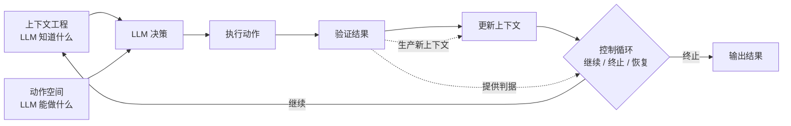

## 写在前面：先把定义收窄

谈 Agent 开发，最大的浪费是一上来就陷入工具、框架、prompt 技巧的细节，却说不清「到底什么让一个系统成为 agent」。所以先立一个足够硬的定义：

**Agent = 上下文工程（供给 + 管理 + 压缩） + 动作空间设计 + 控制循环（继续 / 终止 / 验证 / 恢复）。**

这里有三条**正交**的轴，外加一个把它们缝合起来的**循环**。三条轴正交的意思是：它们各自独立变化，互不替代。你把上下文喂到天上去，也补不了动作空间的粗糙；工具设计得再干净，少了循环它也只是一次性调用。

而循环是**定义性**的——没有循环，系统就退化成一次普通的 LLM 调用，不叫 agent。这一点必须先钉死，后面所有模块都是在为这个循环服务。

但要立刻说清一个反直觉的结论：**循环是定义性的，却不是工程量的大头**。真正的脏活累活，分散在动作空间设计、上下文压缩、验证 / 恢复这些地方。而大家最爱谈、最容易做的「把资料塞够」，恰恰是三件事里最轻的。这篇文章的目的，就是把这个「定义重心」和「工程重心」的错位讲透。

## 一、顶层架构：三轴一环怎么咬合

先给一张心智图，不谈实现，只谈职责边界：

- **上下文工程**管的是「LLM 知道什么」——它面前摊开了哪些信息。
- **动作空间**管的是「LLM 能做什么」——它手里有哪些可以扳动的开关。
- **控制循环**管的是「决策完了往哪走」——继续、停止、还是回头重来。
- **验证**是三者的**枢纽**：它既是上一步动作的结果核验，又生产出新的上下文，还给「要不要继续」提供判据。

一个 agent 跑一圈，本质是这样一条流水：**注入上下文 → LLM 决策 → 执行动作 → 验证结果 → 更新上下文 → 判断继续或终止**。三条轴分别负责这条流水的不同环节，循环把它接成一个闭环。

这里最容易被忽视的是**验证的枢纽地位**。很多失败的 agent 不是决策错了，而是**行动了却不核实**，带着一个未经确认的「成功假设」继续往下跑，错误层层累积。验证既向后连着动作空间（动作到底成没成），又向前连着控制循环（据此决定下一步），它是唯一同时触碰两条轴的模块。把验证做扎实，agent 的稳定性会有质变。

## 二、微观执行：一个 turn 内部发生了什么

把镜头拉到单步（one turn），顺序大致是：

1. **组装 context**——从各种来源（系统提示、历史、检索结果、工具返回、记忆）拼出这一步要喂给模型的窗口。这一步已经在做减法，不是全塞。
2. **模型决策**——输出要么是终态回答，要么是一个或多个 action（工具调用）。
3. **动作执行**——运行工具，拿到 raw 返回。
4. **返回值归一化**——把 raw 结果整理成模型下一轮能吃的形态（裁剪、结构化、错误归类）。这一步属于动作空间设计，常被漏掉。
5. **验证**——这步动作成功了吗？产出的东西对吗？
6. **循环判定**——完成了就终止；没完成就把新状态并回 context，进入下一 turn；原地打转就换策略或升级给人。

微观层看，agent 的质量差距往往藏在第 4、5 步这种「不性感」的地方，而不是第 1 步塞了多少料。

## 三、模块逐个说：是干嘛的、在整个系统起什么作用

下面按模块拆，每个只讲两件事——**它负责什么**、**它在闭环里扮演什么角色**。

### 1. 模式设计（Agent Patterns）

**是什么**：决定 agent 的组织形态。常见几种：

- **单体 ReAct**：一个循环，思考—行动—观察交替。最简单，适合线性任务。
- **Plan-and-Execute**：先规划出步骤清单，再逐条执行。规划和执行分离，适合多步、可预先分解的任务。
- **多 agent / 编排**：一个 orchestrator 把子任务派给多个 sub-agent，各自带独立上下文并行或串行推进，最后汇总。

**起什么作用**：模式设计本质是在决定**循环怎么嵌套、上下文怎么隔离**。多 agent 最大的价值其实不是「分工」，而是**上下文隔离**——每个 sub-agent 用干净的窗口处理一块脏活，不污染主循环。这直接服务于第三条轴（压缩）和控制循环。选错模式，后面三条轴怎么调都别扭。

### 2. 架构设计（整体骨架）

**是什么**：把三轴一环落成可运行的组件——事件驱动还是顺序驱动、状态存在哪、工具怎么注册、错误怎么冒泡、人在环（human-in-the-loop）在哪介入。

**起什么作用**：架构是让「循环可持续跑很久」的地基。一个跑三步就崩的 agent 不需要架构，一个要跑几十上百步、还能被中断和恢复的 agent，架构决定它是否可维护。关键判断点：**状态与逻辑分离**（状态可持久化、可回放）、**动作可拦截**（便于加权限、加验证、加人工确认）。

### 3. 长短期记忆（Memory）

**是什么**：

- **短期记忆**：当前任务的工作状态——对话历史、中间结果、当前计划。生命周期就是这一次任务。它本质是「上下文窗口的临时缓冲」，受窗口大小硬约束。
- **长期记忆**：跨任务、跨会话保留的东西——用户偏好、项目事实、过往经验总结。通常落在外部存储（向量库、KV、文件），按需检索回来。

**起什么作用**：记忆是上下文工程里「管理」这一环的载体。短期记忆解决「这一趟别忘事」，长期记忆解决「下一趟别从零开始」。**关键不是存，而是取**——长期记忆的价值取决于检索能不能在对的时刻捞出对的那条，捞错了反而是噪声，污染窗口。所以记忆系统的难点从来在检索与写入策略（什么值得记、什么时候记），不在存储本身。

### 4. 上下文管理（三轴里最硬的一条）

**是什么**：在有限窗口里，决定「这一步到底放什么进去」。它包含三件事，难度递增：

- **供给**：把决策要用的素材喂进去。最容易，新手视角。
- **管理**：组织多来源信息，排优先级，处理冲突和时序。
- **压缩**：窗口是有限资源，agent 跑长了必然溢出。真正的硬活是**减法**——检索（只取相关的）、摘要（把长历史压成要点）、compaction（把跑过的一大段对话折叠成状态快照）。

**起什么作用**：这是决定 agent 能不能「跑得久、跑得准」的命门。核心矛盾**从来不是信息够不够，而是有限窗口里怎么保留有效信息**。加法谁都会，减法和调度才是分水岭。一个能干活的长程 agent，背后一定有一套像样的 compaction 策略——把已完成阶段压成结论，只在窗口里保留对当前决策还有用的那部分。

### 5. 动作空间设计（被严重低估的一条）

**是什么**：工具集、每个工具的输入结构、返回值形态、命名与描述、可选 action 的粒度。

**起什么作用**：它和上下文正交——上下文管「看到什么」，动作空间管「能做什么」。给再多上下文，**如果工具粒度不对、返回值没法喂回模型、命名让它选错，agent 照样跑不通**。反过来，上下文一般但动作空间干净，往往更好用。

几条实操要点：

- **粒度**：工具太粗（一个工具干十件事）模型选不准参数；太细（几十个原子工具）模型选择负担爆炸。粒度要贴着任务的自然决策颗粒。
- **返回值即上下文**：工具返回什么，直接变成下一轮的输入。返回一坨 raw JSON 是灾难，应该返回模型能直接用、且已裁剪的结构。这一点和上下文压缩是连体的。
- **命名与描述是 prompt**：工具名和描述就是模型选择的依据，写得含糊模型就选错。
- **错误也要设计**：失败返回要能让模型判断「是重试、换参数、还是放弃」，而不是抛个栈就完。

生产环境里 agent 的能力差距，很大一块出在「给什么工具、工具返回什么」，而不是「塞了多少 context」。

### 6. MCP 支持（动作空间的标准化供给）

**是什么**：Model Context Protocol，一套让 agent 以统一协议接入外部工具与数据源的标准。把「每接一个工具都要定制对接」变成「按协议即插即用」。

**起什么作用**：MCP 是**动作空间的规模化供给渠道**——它让工具生态可以被复用和组合，而不是每个 agent 重造轮子。但要清醒：MCP 只解决「接得进来」，不解决「接得好用」。协议塞给你一堆工具，如果不做**筛选和裁剪**，反而会把动作空间撑爆、把工具描述堆满窗口，同时伤害动作空间和上下文两条轴。所以 MCP 的正确用法是按需激活、按需暴露，而不是全量挂载。

### 7. Skill 支持（把经验固化进动作空间与上下文）

**是什么**：把某类任务的知识、流程、最佳实践打包成可复用的能力单元——通常包含说明文档、工作流指引，有时附带专用工具。用到时按需加载。

**起什么作用**：Skill 是**经验的封装与按需注入**。它同时作用于两条轴：一方面往上下文里注入「这类任务该怎么做」的领域知识（上下文轴），一方面可能带来专用工具（动作空间轴）。它的精髓和 MCP 一样是**按需**——平时只占一个名字的位置，匹配到任务才展开完整指令。这本质是一种上下文压缩策略：把大量领域知识挪到窗口外，用一个轻量索引待命，需要时才付出窗口成本。

### 8. 控制循环（定义性一环，细节最容易被漏）

**是什么**：决定「决策完了下一步怎么走」，完整包含四件事：

- **继续 / 终止**：什么时候算做完？怎么防死循环？token 或步数预算烧完怎么办？终止条件写不清，agent 要么早停要么空转。
- **验证**：上一步动作到底成没成？这是最常被跳过的一步，也是最致命的。
- **卡住 / 恢复**：检测到原地打转，怎么换策略？什么时候该升级交给人？
- **预算管理**：步数、token、时间都是有限的，循环要在预算内收敛。

**起什么作用**：循环是让这堆组件「成为 agent」的那一环。少了它，前面七个模块拼起来也只是一次华丽的单次调用。但如前所述，**它虽是定义性的，工程量的大头却不在这里**——真正烧工时的是验证要接哪些信号、恢复要准备哪些备选策略，这些又反过来依赖动作空间（动作返回够不够判断成败）和上下文（历史里能不能看出在打转）。

## 四、业务适配落在哪：别误以为是「多喂素材」

「在通用方案上做加法、做业务适配」这个判断是对的，但要说清它主要落在**两处**，而且都不是「多喂点资料」：

1. **动作空间**：给什么**业务工具**。业务的独特性，大部分体现在「这个领域能做哪些动作、动作长什么样」，而不是「多懂点背景」。
2. **上下文调度**：喂什么**业务数据**、怎么**裁剪**。重点在裁剪策略贴合业务，而不是把业务文档一股脑塞进去。

换句话说，业务适配的重心和通用 agent 的工程重心是一致的——都在动作空间和上下文调度这两条「脏活」轴上。谁把业务落成干净的工具集和精准的上下文裁剪，谁的 agent 就好用。

## 五、收束：一句话和一个提醒

**一句话**：Agent = 上下文工程（供给 + 管理 + 压缩） + 动作空间设计 + 控制循环（继续 / 终止 / 验证 / 恢复）。三条轴正交，循环是让它成为 agent 的定义性一环。

**一个提醒**：定义重心和工程重心是错位的。循环定义了 agent 的存在，但真正的工程难度分散在动作空间设计、上下文压缩、验证与恢复这些不性感的地方。**塞资料是最容易的部分**——把它当成难点，就会一直在最不重要的轴上使劲，而在真正决定成败的地方欠账。做 agent，要在减法、工具、验证上较真，而不是在加法上自我感动。
