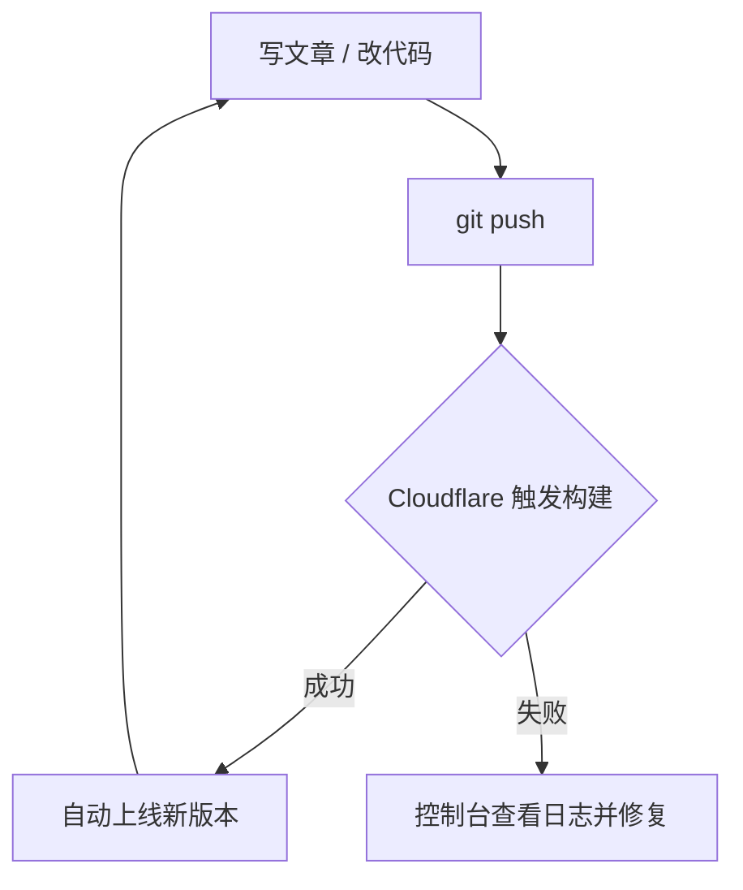

## 引言：无服务器也能有个人网站

很多人以为「拥有一个自己的网站」意味着要租服务器、配环境、管数据库、操心安全更新。其实对绝大多数个人站点——博客、作品集、文档、简历——这些都不需要。

只要把网站构建成**纯静态资源**（HTML/CSS/JS），再托管到像 Cloudflare Pages 这样的静态托管平台，你就能得到一个**零服务器、零运维成本、全球 CDN 加速**的个人网站。

本文会讲清几件事：Astro 是什么、背后的托管原理是怎样的、静态站点和 SSR 有什么区别，以及如何把 GitHub 仓库接到 Cloudflare Pages 实现推送即部署。

## Astro 是什么

Astro 是一个面向内容站点的现代 Web 框架，核心理念是**默认零 JavaScript（zero-JS by default）**：页面在构建期就渲染成静态 HTML，浏览器打开即是最终内容，只有真正需要交互的部分才按需加载脚本。

它有几个关键特点：

- **内容优先**：内置内容集合（Content Collections）与 Markdown/MDX 支持，天生适合写文章和文档。
- **岛屿架构（Islands）**：页面大部分是静态 HTML，交互组件像一座座「岛屿」独立注水，互不拖累。
- **框架无关**：React、Vue、Svelte 等组件可以在同一个项目里混用。
- **静态输出**：`output: 'static'` 模式产出纯静态文件，天然契合免费静态托管。

### 它解决了什么问题

传统单页应用（SPA）往往一上来就加载大量 JS，首屏慢、对搜索引擎不友好。Astro 把「性能」和「可被索引」变成默认值，让个人站点既快又利于 SEO，而不需要你额外做特别优化。

## 原理：托管的到底是什么

理解这套方案，关键是想清楚「Cloudflare Pages 上实际托管的是什么」。

流程是这样的：Cloudflare Pages 连接你的 GitHub 仓库后，会在**云端拉取源码并执行构建命令**（例如 `pnpm build`），Astro 把整个项目编译成一个 `dist/` 目录——里面全是打包好的静态文件。**平台真正对外托管的，是这个 `dist/` 产物，而不是你的源码。**

这带来一个重要推论：**最终产物与框架无关**。无论你在项目里用的是 React、Vue、Svelte，还是它们的混合，构建后都被编译成了浏览器能直接运行的 HTML/CSS/JS。托管平台只认这些静态文件，不关心你当初用什么框架写的。这也正是 Astro 允许 React、Vue、Svelte 等组件在同一个项目里混用的底气所在。

## 静态站点与 SSR 适配器的区别

Astro 支持两种输出模式，理解它们的差异有助于选对方案：

- **静态站点（`output: 'static'`）**：所有页面在**构建期**一次性生成好 HTML，产物是一堆静态文件，直接丢到 CDN 即可，不需要任何服务器运行时。适合内容基本固定的站点——博客、文档、作品集。本文介绍的正是这种。
- **SSR（服务端渲染，需要适配器）**：页面在**用户每次请求时**由服务器动态生成。要跑 SSR，Astro 需要配一个「适配器（adapter）」把应用适配到具体运行环境（如 Node、Cloudflare Workers 等），因此背后必须有一个持续运行的服务。适合需要实时数据、用户登录态、个性化内容的场景。

一句话概括：**静态是「构建时生成、无服务器」，SSR 是「请求时生成、需要运行环境」**。个人网站绝大多数内容是固定的，用静态模式就能兼顾极致性能与零运维，没必要引入 SSR 的复杂度。

## 如果你只想输出文章：一个推荐的快速方案

如果你的诉求很简单——就是想写文章、发出来能被访问和搜索——那推荐直接用 Astro 的**内容集合 + Markdown**：

1. 每篇文章就是一个带 frontmatter（标题、摘要、日期等元信息）的 Markdown 文件。
2. 用内容集合统一管理这些文章，并对元信息做校验，避免格式写错。
3. 配一个动态路由，让每个 Markdown 文件自动生成一个独立页面；再配一个列表页把文章聚合起来。

这样，你日常要做的只有「写一个 md 文件」，构建时页面会自动生成——不用写后端、不用管数据库。本文这篇文章本身，就是用这种方式发布的。

## 结合 GitHub + Cloudflare Pages 部署

把仓库接到 Cloudflare Pages 只需一次配置，之后每次 `git push` 都会自动重新构建并上线。

### 部署步骤

1. 把项目代码推送到 GitHub 仓库。
2. 登录 Cloudflare 控制台，进入 **Workers & Pages → 创建 → Pages → 连接到 Git**，授权并选择你的仓库。
3. 构建配置填写：
   - **构建命令**：`pnpm build`
   - **输出目录**：`dist`
   - **Node 版本**：通过项目里的 `.nvmrc` 或环境变量 `NODE_VERSION` 指定
4. 保存并部署。首次部署完成后即可通过 `*.pages.dev` 域名访问。

### 自动化的持续部署

配置完成后，工作流就变得非常简单：

你几乎不用关心「部署」这件事本身——写完推送，几十秒后线上就更新了。

## 为什么这套方案又快又利于 SEO

### 性能

- **默认零 JS**：首屏就是构建好的 HTML，不等待脚本执行即可阅读。
- **CDN 分发**：Cloudflare 全球节点就近响应，TTFB 极低。
- **按需加载**：只有交互组件才加载对应脚本，其余保持纯静态。

### SEO 简介

SEO（搜索引擎优化）的核心，是让搜索引擎能顺利读懂并收录你的页面。静态站点在这方面天然有优势：

- **内容在构建期就是完整 HTML**：爬虫无需执行 JS 就能读到全部正文，收录更稳。
- **规范的元信息**：每个页面输出 `<title>`、`<meta name="description">` 与 `og:` 社交分享标签，并用 `canonical` 声明规范链接，避免重复内容。
- **结构化数据（JSON-LD）**：文章页可内置 schema.org 的 `Article` 标记，不仅利于传统搜索，也让生成式 AI 引擎更准确地理解与引用内容。

## 总结

对个人网站来说，「无服务器」不是妥协，而是更优解：

- 用 **Astro** 把网站构建成纯静态资源，性能和 SEO 都是默认到位的。
- 平台托管的是 **`dist` 打包产物**，与你用的框架无关，写起来自由。
- 用 **GitHub + Cloudflare Pages** 实现零成本托管与推送即部署，你需要维护的只有内容本身。

如果你也想拥有一个又快又稳、还能被搜索引擎和 AI 正确理解的个人网站，这套组合值得一试。
