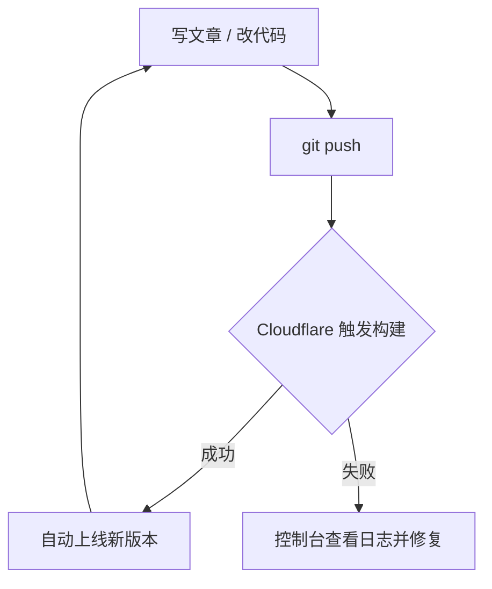

## 引言：无服务器也能有个人网站

很多人以为「拥有一个自己的网站」意味着要租服务器、配环境、管数据库、操心安全更新。其实对绝大多数个人站点——博客、作品集、文档、简历——这些都不需要。

只要把网站构建成**纯静态资源**（HTML/CSS/JS），再托管到像 Cloudflare Pages 这样的静态托管平台，你就能得到一个**零服务器、零运维成本、全球 CDN 加速**的个人网站。本项目正是这样一个例子：用 [Astro](https://astro.build/) 构建，代码放在 GitHub，推送即自动部署。

本文会讲清三件事：

- Astro 是什么，为什么适合内容型个人站点
- 如何用它开发，以及本项目的结构
- 如何把 GitHub 仓库接到 Cloudflare Pages 实现自动部署

## Astro 是什么

Astro 是一个面向内容站点的现代 Web 框架，核心理念是**默认零 JavaScript（zero-JS by default）**：页面在构建期就渲染成静态 HTML，浏览器打开即是最终内容，只有真正需要交互的部分才按需加载脚本。

它有几个关键特点：

- **内容优先**：内置内容集合（Content Collections）与 Markdown/MDX 支持，天生适合写文章和文档。
- **岛屿架构（Islands）**：页面大部分是静态 HTML，交互组件像一座座「岛屿」独立注水，互不拖累。
- **框架无关**：React、Vue、Svelte 等组件可以在同一个项目里混用。
- **静态输出**：`output: 'static'` 模式产出纯静态文件，天然契合免费静态托管。

### 它解决了什么问题

传统单页应用（SPA）往往一上来就加载大量 JS，首屏慢、对搜索引擎不友好。Astro 把「性能」和「可被索引」变成默认值，让个人站点既快又利于 SEO，而不需要你额外做特别优化。

## 整体架构

本项目从内容到上线的流程可以用下面这张图表示：


整个链路没有任何一台你需要维护的服务器：你只管写内容和代码，推送到 GitHub，剩下的构建与分发都由平台自动完成。

## 如何使用 Astro

### 安装与启动

Astro 需要 Node.js 环境，用你熟悉的包管理器安装依赖后即可启动本地开发服务器：

```bash
pnpm install
pnpm dev
```

开发服务器基于 Vite，热更新极快。要产出可部署的静态文件，运行构建命令：

```bash
pnpm build
```

产物会输出到 `dist/` 目录，这就是最终要托管的全部内容。

### 本项目的内容组织

本项目的文章都放在 `src/content/article/` 下，每篇是一个带 frontmatter 的 Markdown 文件：

```markdown
---
title: 文章标题
description: 用于 SEO 与分享的摘要
pubDate: 2026-07-12
tags: [示例]
---

## 正文标题
正文内容……
```

新增一篇文章，只需在该目录丢一个 md 文件，构建时会自动生成对应页面（如 `/article/你的文件名`），无需改任何配置。文章列表页 `/article` 也会自动收录并按日期排序。

### 内容与展现分离

本项目遵循「配置驱动」的原则：首页的所有文案、区块顺序都写在 `src/config/site.config.ts`，组件不硬编码业务内容。想改首页、加入口，改配置即可，不用动组件代码。

## 结合本项目：GitHub + Cloudflare Pages 部署

把仓库接到 Cloudflare Pages 只需一次配置，之后每次 `git push` 都会自动重新构建并上线。

### 部署步骤

1. 把项目代码推送到 GitHub 仓库。
2. 登录 Cloudflare 控制台，进入 **Workers & Pages → 创建 → Pages → 连接到 Git**，授权并选择你的仓库。
3. 构建配置填写：
   - **构建命令**：`pnpm build`
   - **输出目录**：`dist`
   - **Node 版本**：通过项目里的 `.nvmrc` 或环境变量 `NODE_VERSION` 指定
4. 保存并部署。首次部署完成后即可通过 `*.pages.dev` 域名访问。

### 自动化的持续部署

配置完成后，工作流就变得非常简单：



你几乎不用关心「部署」这件事本身——写完推送，几十秒后线上就更新了。

## 为什么这套方案又快又利于 SEO

### 性能

- **默认零 JS**：首屏就是构建好的 HTML，不等待脚本执行即可阅读。
- **CDN 分发**：Cloudflare 全球节点就近响应，TTFB 极低。
- **按需加载**：只有交互组件（如本站的动画、流程图渲染）才加载对应脚本，其余保持纯静态。

### SEO

- **内容在构建期就是完整 HTML**：搜索引擎爬虫无需执行 JS 就能读到全部正文。
- **规范的元信息**：每个页面都输出 `<title>`、`<meta name="description">` 与 `og:` 社交分享标签，并配置了 `canonical` 规范链接。
- **结构化数据（JSON-LD）**：文章页内置 schema.org 的 `Article` 标记，不仅利于传统搜索，也让生成式 AI 引擎（GEO）能更准确地理解与引用内容。

## 总结

对个人网站来说，「无服务器」不是妥协，而是更优解：

- 用 **Astro** 把网站构建成纯静态资源，性能和 SEO 都是默认到位的。
- 用 **GitHub + Cloudflare Pages** 实现零成本托管与推送即部署。
- 你需要维护的只有内容本身，没有服务器、没有运维负担。

如果你也想拥有一个又快又稳、还能被搜索引擎和 AI 正确理解的个人网站，这套组合值得一试。
